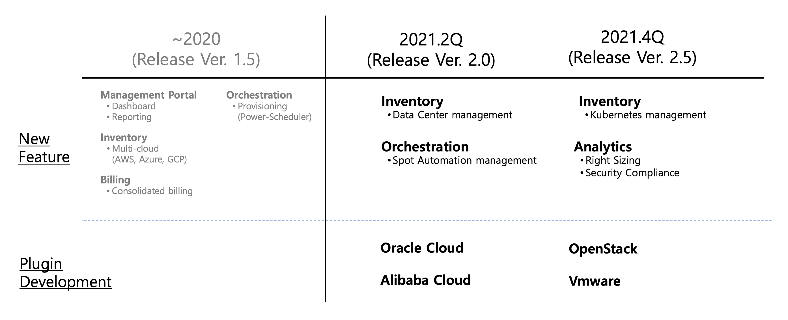

# SpaceONE Development Roadmap

You can find the detailed SpaceONE roadmap at [SpaceONE project page](https://github.com/spaceone-dev/spaceone/projects/1).

The feature list of roadmap can be changed after summarizing users' issues or requests.
If you have new idea or requests, create a new **issue**. 

# Roadmap Change History

## 2020-11 Updates (Ver. 1.5.1)

### On-schedule
* Dashboard renewal will be released at Ver 1.5

### New features
* Support multiple languages (English, Korean, Japanese)
* We will support MongoDB instead of AWS DocDB. 

## 2020-10 Updates (Ver. 1.4)

### On-schedule
* Power Scheduler will be released

### Re-schedule
* Sign-in Refactoring will be delayed at Ver 1.5
* Linux Security Check plugin will be integrated with Comnpliance service

### New Features
* AWS Power state collector, Google Cloud Power state collector was added, which are related with **NEW** Power-Scheduler service.

## 2020-09 Updates (Ver. 1.3)

### On-schedule
* Google Cloud collector
* Azure Cloud collector

### Re-schedule
* RBAC is postponed to Ver 1.6
* Reporting is postponed to 2021
* Kubernetes is postponed to 2021
* IaC is postponsed to 2021

## New Features
* Power Scheduler will be released in Ver 1.4
* Billing service will be developed in Ver 1.5
* New plugin **AWS Trusted Advisor**
* New Plugin **AWS Health Dashboard**

